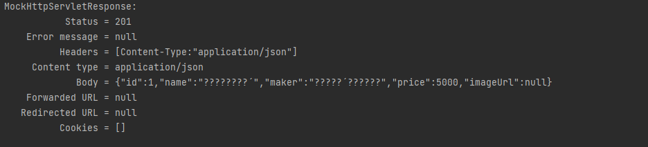
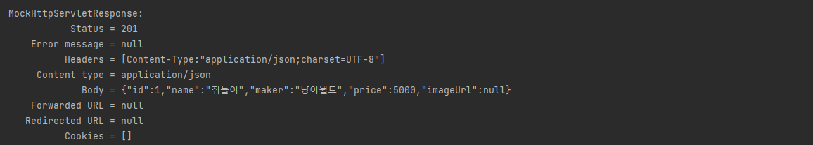

MediaType.APPLICATION_JSON_UTF8은 `@Deprecated` 사용이 권장되지 않음이다. 즉 언젠가 사라질 수 있다는 말이다. 

크롬같은 메인 브라우저에서는 UTF8을 자동으로 받기때문이라고 설명되어있다. (아닐수도)

그렇다면 굳이 인코딩을 해야할까? 

-> 테스트 코드를 작성 후 돌려보면 한글이 깨져서 테스트가 실패하는 경우가 있다. 그렇다면 어떻게 인코딩을 해야할까. 

```java
    @Autowired
    private WebApplicationContext wac;

    @BeforeEach
    void setUp() {
        this.mockMvc = MockMvcBuilders.webAppContextSetup(wac)
                .addFilters(new CharacterEncodingFilter("UTF-8", true))
                .alwaysDo(print())
                .build();
    }
```
- 테스트 전에 `CharacterEncodingFilter`를 추가해주면 해결된다. 

|코드 추가 전 (UTF8 미설정)|
| :---: |
||
|코드 추가 후 (UTF8 설정)|
||

- Header에 `UTF-8`이 들어간 것을 확인할 수 있다. 

- `WebApplicationContext`는 DispatcherServlet 클래스에 의해 만들어진다. 
  - `DispatcherServlet`이 직접 사용하는 컨트롤러를 포함한 웹 관련 빈을 등록하는 데 사용한다. 
  - 독자적인 컨텍스트들을 가지며 root-context 내 빈 사용이 가능하다. 
  - `ApplicationContext`를 확장한 구현체다.


### 다른 방법들 
- [커스텀 어노테이션](https://jehuipark.github.io/spring/boot-2-2-x-mock-mvc-encoding-issue)
- [SpringBootMockMvcBuilderCustomizer 사용](https://pompitzz.github.io/blog/Spring/MockMvc_Encoding.html#%E1%84%8B%E1%85%A8%E1%84%89%E1%85%B5)

### 참고 
- [Spring Test MockMvc의 한글 깨짐 처리](https://velog.io/@lsj8367/Spring-Test-MockMvc%EC%9D%98-%ED%95%9C%EA%B8%80-%EA%B9%A8%EC%A7%90-%EC%B2%98%EB%A6%AC)
- [[Spring] ApplicationContext와 WebApplicationContext](https://kingofbackend.tistory.com/78)

