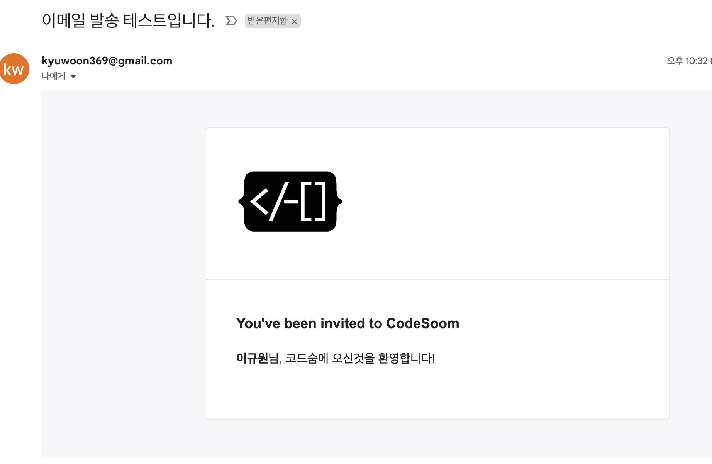

## 우당탕탕 주니어 개발자의 자바 마이그레이션: 메일 서비스 추상화

### 주절주절 사건의 발단

대략 3개월 간의 파이썬 장고에서 자바 스프링 부트로의 마이그레이션이 끝났다. 거의 혼자 진행하느라 이렇게 하는게 맞는지 나날이 의문은 쌓여갔다. 주변 개발자분들께 묻고, 스터디하고, 책에서 배운 것들을 그날 그날 적용하며 마이그레이션을 진행했다. 

그날 그날 새로운 정보들이 업데이트되는 바람에 약 일주일전 코드는 바로 레거시 코드가 되었고, 계속 리팩토링을 하며 마이그레이션을 했다. 지금도 손봐야 할 곳이 여기저기 많이 있다. 우션 마이그레이션의 목표는 장고를 떼버리고 기존의 동작을 다 하는 것이었기 때문에 완료되었다고 보고있다. 마이그레이션을 진행하면서도 좋은 설계를 하고 싶은 욕심이 가득했어서 리팩토링을 놓지 않았다. 

지금부터 마이그레이션과 리팩토링을 하면서 배운 내용이나 고민되는 내용들을 하나씩 써보려고 한다. 제일 첫번째는 메일 서비스 추상화이다. 기존에는 AWS의 SES를 이용해서 메일 서비스를 했다. 하지만 AWS 의존성을 떼어내고 온프레미스에서도 사용할 수 있고 SMTP 서버가 바껴도 코드 구현의 변경이 아닌 설정만 변경해도 제대로 동작하는 서비스를 만들어야했다. 자바에서 제공하는 JavaMail을 이용해서 메일 발송을 구현했으나, 문제가 생겼다. 실제 동작하는 코드이나 테스트를 작성할 수가 없었다. 정확히 말하면 테스트도 이메일이 발송되거나 실제 SMTP 서버가 있어야 동작하게 만들어 버렸다. AWS 의존을 썼을 때는 추상화가 잘 되었던거 같은데 왜 이런 문제가 생겼을까? 그렇다면 메일 서비스는 어떻게 추상화하고 테스트를 하면되지? 고민이 생겼다. `디자인 패턴의 아름다움`이라는 책의 스터디를 준비하며, 같이 읽기를 하는 모임에서 다른 분들이 토비의 스프링에 나온다고 하셨다. 정확히 궁금했던 내용이 토비의 스프링 5.4절에 나왔다. 갓 토비!!!  그래서 지금부터 5.4절을 학습하고 실무에 적용하려고 한다. 

### 기존 코드 살펴보기 

```java 
@Service
public class EmailService {
    private final JavaMailSender javaMailSender;
    private final ISpringTemplateEngine htmlTemplateEngine;

    public EmailService(JavaMailSender javaMailSender, ISpringTemplateEngine htmlTemplateEngine) {
        this.javaMailSender = javaMailSender;
        this.htmlTemplateEngine = htmlTemplateEngine;
    }

    /**
     * Thymeleaf 템플릿을 통해 이메일을 발송합니다.
     *
     * @param emailSenderDTO 이메일 전송 객체
     * @param template       사용할 템플릿 이름
     * @param variables      템플릿에 넣을 변수
     * @throws MessagingException
     */
    public void sendTemplateByThymeleaf(EmailSenderDto emailSenderDTO, String template, Map<String, Object> variables) throws MessagingException {
        MimeMessage message = javaMailSender.createMimeMessage();
        MimeMessageHelper helper = new MimeMessageHelper(message, true, "UTF-8");

        helper.setSubject(emailSenderDTO.getSubject());
        helper.setTo(emailSenderDTO.getTo());
        helper.setFrom(emailSenderDTO.getFrom());

        Context context = createContext(variables);
        String html = htmlTemplateEngine.process(template, context);
        helper.setText(html, true);

        helper.addInline("logo", new ClassPathResource("static/images/codesoom_logo.png"));

        javaMailSender.send(message);
    }

    /**
     * Template에 매핑시킬 파라미터를 Context로 변환한다
     *
     * @param variables
     * @return
     */
    private Context createContext(Map<String, Object> variables) {
        Context context = new Context();
        context.setVariables(variables);

        return context;
    }
}
```
해당 코드는 Thymeleaf 템플릿을 이메일로 발송하는 코드이다. 간단하게 이메일 발송에 필요한 정보, 템플릿 이름, 템플릿에 매핑시킬 변수들을 받아서 이메일을 발송한다. 


```html
<!DOCTYPE html>
<html lang="en" , xmlns:th="http://www.thymeleaf.org">
<head>
    <meta charset="UTF-8">
    <meta name="viewport" content="width=device-width, initial-scale=1.0">
    <meta http-equiv="X-UA-Compatible" content="ie=edge">
</head>
<body>
<div style="width: 100%; background-color: #f6f6fb; padding: 48px 0;">
    <div style="width: 600px; border: 1px solid #e5e7eb; border-radius: 4px; margin: 0 auto; background-color: white;">
        <div style="padding: 25px 40px">
            
        </div>

        <div style="width: 100%; height: 1px; background-color: #e5e7eb;"></div>

        <div style="padding: 25px 40px 50px;">
            <h3 style="margin-bottom: 20px; font-size: 18px; font-weight: bold;">You've been invited to CodeSoom</h3>
            <p style="margin-bottom: 16px; font-size: 16px;">
                <strong>[[ ${target_name} ]]</strong>님, 코드숨에 오신것을 환영합니다!
            </p>
        </div>
    </div>
</div>
</body>
</html>
```
위의 코드는 Thymeleaf 코드이다. 

위의 코드를 실행해보면 이메일이 발송된다. 



메일 발송이란 부하가 큰 작업이다. 실제 운영 중인 메일 서버를 통해 테스트를 실행할 때마다 메일을 보내면 메일 서버에 부담을 줄 수 있다. 또 실제로 발송된다는 문제가 있다. 테스트 메일 서버로 메일을 진짜로 전송하지 않고 메일 전송 요청을 받았는지만 확인하면 된다. 더 나아가서 EmailService를 사용하는 컨트롤러에서 통합 테스트를 한다고 했을 때, 이 때에도 실제 메일 발송을 할 필요없이 목 오브젝트를 이용해서 메일 전송이 됐는지 확인을 할 수 있다. 

### 테스트 가능한 메일 서비스 추상화 


